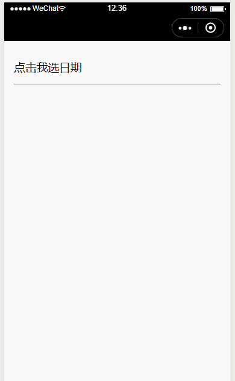

# 小程序日期、日期范围选择 日历组件

*效果如图：*



## 如何使用
按照小程序官方组件说明，引入该仓库下的My-calendar组件即可

## 属性
||属性名|参数类型|是否必选|说明|可选值|默认值|
|-|-|-|-|-|-|-|
|1|useType|\<String\>|no|指定选择类型（range范围选择、touch日期选择）| range\touch|range|
|2|confirmText|\<String\>|no|确认按钮显示文本|||
|3|confirmType|\<String\>|no|指定选择完成时机(end选择完成即触发confirm、button点击确认按钮才触发confirm)|end\button|end|
|4|date|\<String\>|no|单选模式时用作指定默认选择日期（字符必须为xxxx-xx-xx格式）|||
|5|start|\<String\>|no|范围选择模式时用作指定默认范围开始日期，必须为xxxx-xx-xx格式字符串|||
|6|stop|\<String\>|no|范围选择模式时用作指定默认范围结束日期，必须为xxxx-xx-xx格式字符串|||
|7|min|\<String\>|no|起始选择最小日期限制，必须为xxxx-xx-xx格式字符串或“row”,为row时表示起始范围不得小于今天|row||
|8|max|\<String\>|no|起始选择最大日期限制，必须为xxxx-xx-xx格式字符串|||


## 事件
||事件名|说明|携带参数|
|-|-|-|-|
|1|cancel|取消按钮触发的取消事件|  |
|1|confirm|确定按钮触发的取消事件| 详见下方代码 |

```javascript
/*
*confirm事件携带参数
*/

//日期范围选择模式时
detail: {
    begin: {
        text: "2002-12-12",
        time: "324234234",//时间戳
    },
    over: {
        text: "2002-12-22",
        time: "2342342342",//时间戳
    }
}
//日期单选模式时
detail: {
    text: "xxxx-xx-xx",
    time: "1234123123",//时间戳
}

```

*水平有限，欢迎指点和star*