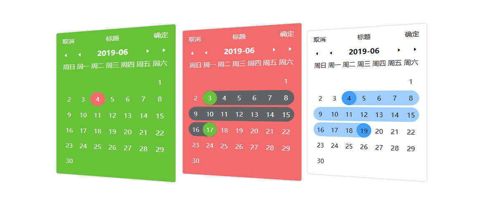
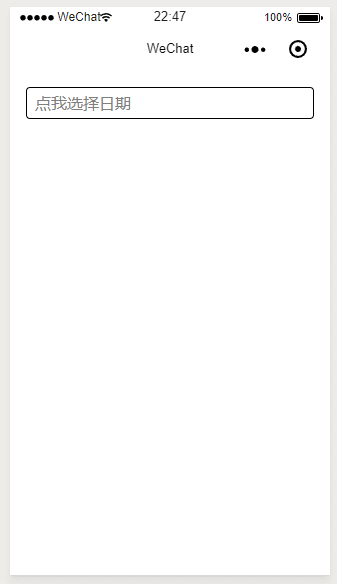
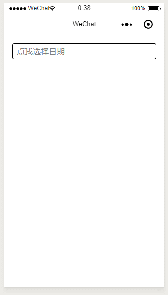
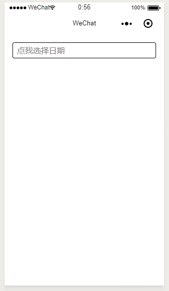
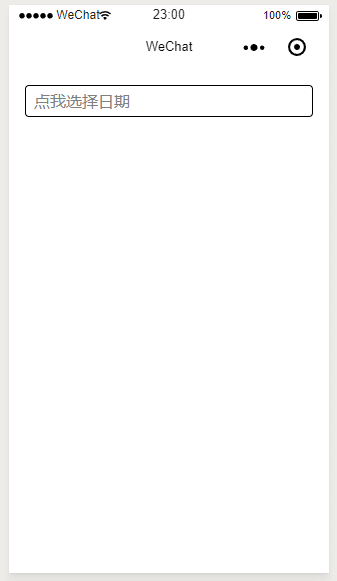
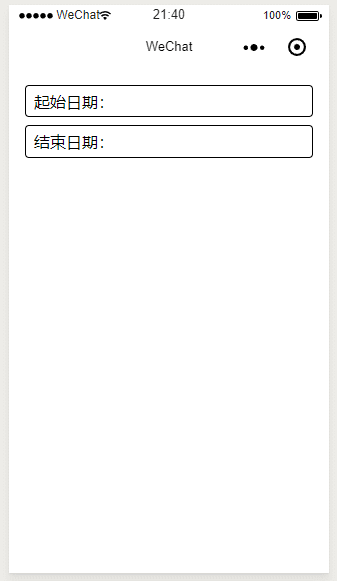
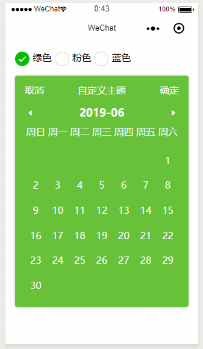

# My-calendar 小程序日历组件
*最近更新于2019/06/26；旧版说明文档<a href="./README/oldReadme.md">点这里</a>*



## 应用场景展示

### 1.基本日期选择

<details>
<summary>查看源码</summary>

</br>


```html
<input value="{{date}}" placeholder='点我选择日期' bindtap='openCalendar'/>

<!-- 组件 -->
<my-calendar 
wx:if="{{calendarShow}}"
title="简单日期选择"
useType="touch"
date="{{date}}"
touchColor="#409efe"
bind:confirm="select"
bind:cancel="offCalendar"
/>
```


```js
Page({
  data: {
    date: "",
    calendarShow: false,
  },
  select ({detail}) {
    this.setData({ date: detail.text });
    this.offCalendar();
  },
  openCalendar () {
    this.setData({calendarShow: true});
  },
  offCalendar () {
    this.setData({ calendarShow: false });
  }
});
```
</details>

### 2.指定日期选择

<details>
<summary>查看源码</summary>

</br>


```html
<input value="{{date}}" placeholder='点我选择日期' bindtap='openCalendar'/>

<my-calendar 
wx:if="{{calendarShow}}"
title="指定日期选择"
useType="touch"
actives="{{actives}}"
date="{{date}}"
bind:confirm="select"
bind:cancel="offCalendar"
/>
```


```js
Page({
  data: {
    actives: ["2019-06-23", "2019-06-25", "2019-06-30"],/*指定允许选择的日期*/
    date: "",
    calendarShow: false,
  },
  select ({detail}) {
    this.setData({ date: detail.text });
    this.offCalendar();
  },
  openCalendar () {
    this.setData({calendarShow: true});
  },
  offCalendar () {
    this.setData({ calendarShow: false });
  }
});
```

</details>

### 3.指定日期选择带文本

<details>
<summary>查看源码</summary>

</br>


```html
<input value="{{date}}" placeholder='点我选择日期' bindtap='openCalendar'/>

<my-calendar 
wx:if="{{calendarShow}}"
title="指定日期选择带文本"
useType="touch"
actives="{{actives}}"
date="{{date}}"
bind:confirm="select"
bind:cancel="offCalendar"
/>
```


```js
Page({
  data: {
    actives: [
      {date: "2019-06-24", text: "￥1333.3"}, //每个单元增加了text属性用于定义需要显示的文本
      {date: "2019-06-25", text: "￥998.01"},
      {date: "2019-06-26", text: "￥998.01"},
      {date: "2019-06-27", text: "￥998.01"}
    ],
    date: "",
    calendarShow: false,
  },
  select ({detail}) {
    this.setData({ date: detail.text });
    this.offCalendar();
  },
  openCalendar () {
    this.setData({calendarShow: true});
  },
  offCalendar () {
    this.setData({ calendarShow: false });
  }
});
```
</details>

### 4.指定范围日期选择

<details>
<summary>查看源码</summary>

<br>


```html
<input value="{{date}}" placeholder='点我选择日期' bindtap='openCalendar'/>

<my-calendar 
wx:if="{{calendarShow}}"
title="指定范围日期选择"
useType="touch"
min="2019-06-15"
max="2019-06-25"
date="{{date}}"
start="{{start}}"
stop="{{stop}}"
bind:confirm="select"
bind:cancel="offCalendar"
/>
```


```js
Page({
  data: {
    date: "",
    calendarShow: false,
  },
  select ({detail :{text}}) {
    this.setData({ 
      date: text
    });
    this.offCalendar();
  },
  openCalendar () {
    this.setData({calendarShow: true});
  },
  offCalendar () {
    this.setData({ calendarShow: false });
  }
});
```

</details>


### 5.基本日期范围选择

<details>
<summary>查看源码</summary>

<br>


```html
<input value="起始日期：{{start}}" placeholder='点我选择日期' bindtap='openCalendar'/>
<input value="结束日期：{{stop}}" placeholder='点我选择日期' bindtap='openCalendar'/>

<my-calendar 
wx:if="{{calendarShow}}"
title="基本日期范围选择"
useType="range"
start="{{start}}"
stop="{{stop}}"
bind:confirm="select"
bind:cancel="offCalendar"
/>
```


```js
Page({
  data: {
    start: "",
    stop: "",
    calendarShow: false,
  },
  select ({detail :{begin: {text:begin}, over: {text: over}}}) {
    console.log(begin, over);
    this.setData({ 
      start: begin,  
      stop: over
    });
    this.offCalendar();
  },
  openCalendar () {
    this.setData({calendarShow: true});
  },
  offCalendar () {
    this.setData({ calendarShow: false });
  }  
});

```
</details>

### 6.指定范围日期范围选择

<details>
<summary>查看源码</summary>

<br>


```html
<input value="起始日期：{{start}}" placeholder='点我选择日期' bindtap='openCalendar'/>
<input value="结束日期：{{stop}}" placeholder='点我选择日期' bindtap='openCalendar'/>

<my-calendar 
wx:if="{{calendarShow}}"
title="指定范围日期范围选择"
useType="range"
min="now"
max="2019-06-30"
start="{{start}}"
stop="{{stop}}"
bind:confirm="select"
bind:cancel="offCalendar"
/>
<!--min属性可以为指定日期（如：2019-05-05）；也可以为now，为now则表示以今天为范围选择起始-->
```


```js
Page({
  data: {
    start: "",
    stop: "",
    calendarShow: false
  },
  select ({detail :{begin: {text: begin}, over: {text: over}}}) {
    console.log(begin, over);
    this.setData({ 
      start: begin,  
      stop: over
    });
    this.offCalendar();
  },
  openCalendar () {
    this.setData({ calendarShow: true });
  },
  offCalendar () {
    this.setData({ calendarShow: false });
  }
});
```
</details>

### 7.自定义主题


*^-^我不是ui，配色大家随便看就行*
<details>
<summary>查看源码</summary>

<br>


```html
<radio-group class="radio-group" bindchange="radioChange">
  <label class="radio" wx:for="{{items}}">
    <radio value="{{item.name}}" checked="{{item.checked}}"/>{{item.value}}
  </label>
</radio-group>

<my-calendar
title="自定义主题"
useType="range"
start="{{start}}"
stop="{{stop}}"
bind:confirm="select"
background="{{theme.bg}}"
fontColor="{{theme.fontColor}}"
rangeColor="{{theme.rangeColor}}"
rangeStartColor="{{theme.rangeStartColor}}"
rangeEndColor="{{theme.rangeEndColor}}"
/>
```


```js
Page({
  data: {
    start: "",
    stop: "",
    theme: null,
    themes: {
      green: {
        bg: "#67C23A",
        fontColor: "#fff",
        rangeStartColor: "#F56C6C",
        rangeColor: "#fde2f2",
        rangeEndColor: "#F56C6C"
      },
      pink: {
        bg: "#F56C6C",
        fontColor: "#fff",
        rangeStartColor: "#67C23A",
        rangeColor: "#e1f3d8",
        rangeEndColor: "#67C23A"
      },
      blue: {
        bg: "#409efe",
        fontColor: "#fff",
        rangeStartColor: "#79bbff",
        rangeColor: "#b3d8ff",
        rangeEndColor: "#79bbff"
      }
    },
    items: [
      { name: 'green', value: '绿色', checked: true },
      { name: 'pink', value: '粉色' },
      { name: 'blue', value: '蓝色' }
    ]
  },
  onLoad () {
    this.setData({
      theme: this.data.themes.green
    });
  },

  radioChange: function (e) {
    this.setData({
      theme: this.data.themes[e.detail.value]
    });
  },

  select ({detail: {begin: {text: brgin}, over: {text: over}}}) {
    this.setData({
      start: begin,
      stop: over
    });
  }
})
```
</details>

<br>
<br>

## 属性、事件
### 1.通用属性
|属性|说明|数据类型|默认值|可选值|备注/注意|
|-|-|-|-|-|-|
|title|标题|String|-|-|-|
|useType|使用模式|String|"range"|"range"、"touch"|touch为日期单选模式，range为日期范围选择模式|-|
|isChangeYear|是否启用年份切换|Boolean|false|-|-|
|confirmText|确认按钮文本|String|"确定"|-|-|
|confirmType|指定什么时候触发confirm事件|String|"button"|"button"、"end"|为button时表示要点击确定按钮才触发confirm，为end时选择结束就触发confirm|
|min|设置最小选择日期（含）|String|-|"now"|格式必须为日期字符串如： xxxx-xx-xx, 为now时候表示以今天为最小选择日期起始|
|max|设置最大选择日期（含）|String|-|-|格式必须为日期字符串如： xxxx-xx-xx|

### 2.日期单选模式属性
|属性|说明|数据类型|默认值|可选值|备注/注意|
|-|-|-|-|-|-|
|date|初始化选中日期|String|-|-|格式必须为日期字符串如： xxxx-xx-xx|
|actives|指定可选择日期|Array|-|-|普通用法["xxx-xx-xx", ...]；显示文本用法[{date: "xxxx-xx-xx", text: "￥998，,0"}, ...]|

### 3.日期范围选择模式属性
|属性|说明|数据类型|默认值|可选值|备注/注意|
|-|-|-|-|-|-|
|start|指定范围开始选中|String|-|-|格式必须为日期字符串如： xxxx-xx-xx|
|stop|指定范围结束选中|String|-|-|格式必须为日期字符串如： xxxx-xx-xx|

### 4.主题属性
|属性|说明|数据类型|默认值|可选值|备注/注意|
|-|-|-|-|-|-|
|background|背景颜色|String|-|-|css\wxss支持的颜色都可以|
|isShadow|是否显示阴影|Boolean|true|true、false|-|
|isRound|是否显示圆角|Boolean|true|true、false|-|
|touchColor|日期单选选中的颜色|String|-|-|css\wxss支持的颜色都可以|
|rangeStartColor|日期范围选择起始选中颜色|String|-|-|css\wxss支持的颜色都可以|
|rangeColor|日期范围选中起始和结束之间的颜色|String|-|-|css\wxss支持的颜色都可以|
|rangeEndColor|日期范围选择结束选中颜色|String|-|-|css\wxss支持的颜色都可以|
|fontColor|字体颜色|String|-|-|css\wxss支持的颜色都可以|

### 5.事件
|事件|说明|参数|参数类型|备注/注意|
|-|-|-|-|-|
|cancel|点击取消按钮触发|-|-|没有传参|
|confirm|点击确定或选择完成时候触发|{detail: {*}}|Object|日期范围选择模式、日期单选模式参数不同，请看下面的代码|
```js
/**
 * @description confirm事件的携带参数说明
 */

 //为日期单选模式时
 {
   detail: {
     text: "2019-12-12",
     time: 111111 //时间戳
   }
 }

 //为日期范围选择模式时
 {
   detail: {
     begin: {
       text: "2019-12-12",
       time: 111111
     },
     over: {
       text: "2019-12-13",
       time: 111111
     }
   }
 }
```
